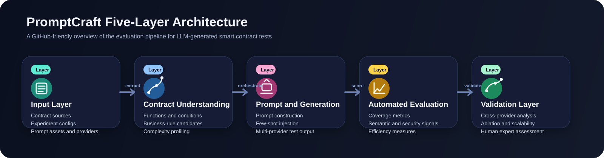

# PromptCraft Public Artifact Package

This repository is a **public artifact package** accompanying the paper **PromptCraft: Quantifying the Semantic-Syntactic Gap in LLM-Generated Smart Contract Tests through Multi-Provider Evaluation**.

It is an **evaluation-facing artifact repository**, not the complete private research codebase. The public release is intentionally scoped to expose the evidence needed to verify the paper's empirical claims while withholding private generation infrastructure and provider-specific orchestration.

## What is publicly released

- dataset and benchmark catalogs for the 219-contract candidate pool,
- released aggregate CSV tables corresponding to the paper's main experiments,
- minimal public scripts that verify and inspect selected released summary statistics,
- human-evaluation rubric and blank scoring templates,
- a small number of representative sample artifacts,
- a documented end-to-end example showing input, prompt excerpt, raw-output excerpt, and cleaned structured output.

## What is not publicly released

- the full LLM invocation backend,
- provider-specific integration code and orchestration scripts,
- full private prompt-engineering assets,
- API keys, secrets, and production configuration,
- full row-level raw annotation release beyond a small sample sheet.

These components are withheld because they contain private engineering assets, provider-specific operational logic, or materials that would misleadingly suggest a complete open-source rerun environment. This repository therefore supports **paper review, artifact inspection, and summary-level reproducibility checks**, not full regeneration of all experiments from scratch.

## Framework Overview



## Repository Structure

```text
promptcraft/
├── README.md
├── LICENSE
├── assets/
├── data/
│   ├── catalog/
│   └── results/
├── docs/
├── evaluation/
├── samples/
├── scripts/
└── config/
```

### `data/catalog/`
- `contract_catalog.csv`: 219-contract candidate-pool catalog with source links.
- `complexity_scores.csv`: empirical complexity scores used for quartile-based tiering.
- `experiment_subset_overview.csv`: experiment sizes and benchmark notes.

### `data/results/`
Released result tables directly corresponding to the paper, including:
- `exp1_baseline_by_tier.csv`
- `exp2_provider_summary.csv`
- `exp2_gap_summary.csv`
- `exp3_ablation_summary.csv`
- `exp4_provider_scalability_summary.csv`
- `exp4_complexity_scaling_summary.csv`
- `exp5_human_evaluation_summary.csv`
- `exp5_provider_human_summary.csv`
- `exp5_correlation_summary.csv`
- `released_result_index.csv`

For `Exp2`, the field `avg_retained_sample_count` in `exp2_provider_summary.csv` refers to the mean number of retained public sample rows per contract-provider observation in the released summary package. It should not be interpreted as the full average number of raw generated test cases per run.

For `Exp3`, the released ablation summary intentionally focuses on stable aggregate dimensions used in the paper-level comparison (`overall_score`, `delta_vs_base`, `semantic_understanding_score`, `function_coverage`, and `branch_coverage`) rather than sparse auxiliary metrics that are less informative in a compact public artifact.

For `Exp4`, the public tables only expose aggregate runtime and test-count trends over successful evaluated observations.

The `data/` directory intentionally publishes the **minimum benchmark catalogs and released summary tables needed to verify the paper's reported claims**. Intermediate production tables and internal analysis artifacts are omitted from the public artifact package.

### `docs/`
- `artifact_scope.md`
- `public_private_scope.md`
- `prompt_excerpt_zero_shot.md`
- `prompt_excerpt_few_shot.md`
- `end_to_end_pipeline_example.md`

### `evaluation/`
- `evaluation_guidelines.md`
- `human_evaluation_template_blank.csv`
- `merged_expert_ratings_sample.csv`

### `samples/`
- `contract_input_excerpt.sol`
- `raw_model_output_excerpt.txt`
- `cleaned_structured_output_sample.csv`

### `scripts/`
- `quick_check.py`
- `recompute_public_summaries.py`

## Public / Private Scope

See [`docs/public_private_scope.md`](docs/public_private_scope.md) for the detailed release boundary.

## Quick Start

### 1. Basic artifact sanity check

```bash
python3 scripts/quick_check.py
```

Expected output snippet:

```text
PromptCraft public artifact quick check
--------------------------------------
Candidate-pool contracts: 219
Released Exp2 provider rows: 7
Top Exp2 provider by overall mean: grok 52.9402
Exp5 sampled test cases: 200
Exp5 expert scoring instances: 600
```

### 2. Verify selected released summaries

```bash
python3 scripts/recompute_public_summaries.py
```

Expected output snippet:

```text
Verified Exp2 released public summaries
--------------------------------------
grok     zero=52.39 few=51.76 overall=52.94
claude   zero=42.78 few=48.35 overall=46.34
...
Structural-to-semantic-understanding ratio: 1.53x
```

### 3. Inspect the end-to-end example

Open [`docs/end_to_end_pipeline_example.md`](docs/end_to_end_pipeline_example.md) to see:
- raw contract input excerpt,
- sanitized prompt excerpt,
- representative raw model-output excerpt,
- cleaned structured output sample.

## API Key Statement

This public artifact repository does **not** include the private generation backend. The scripts in `scripts/` do not require any API keys. Researchers who want to plug in their own generation workflow may use `config/api_config_template.yaml` as a placeholder and must provide their own provider credentials.

## Notes on scope and interpretation

- The repository is designed to support **review-time verification** of the paper's released evidence.
- It should not be interpreted as a fully reproducible provider-orchestration codebase.
- The public `data/` release is intentionally conservative: it includes benchmark catalogs and aggregate experiment tables needed to inspect and verify the paper's reported claims, while omitting intermediate production tables.
- The file naming intentionally uses honest names such as `exp5_human_evaluation_summary.csv`, `merged_expert_ratings_sample.csv`, and `end_to_end_pipeline_example.md` to avoid suggesting that the public package contains the full private backend or every raw artifact.

This project is licensed under the MIT License.
